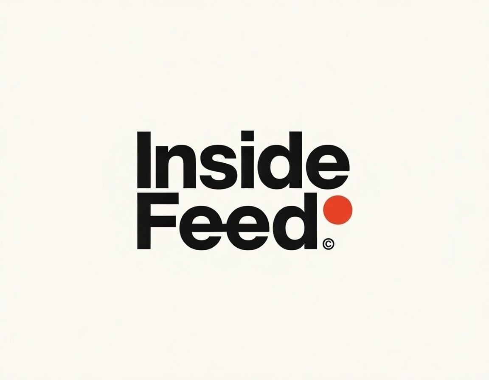

<!-- Improved compatibility of back to top link -->
<a id="readme-top"></a>

<!-- PROJECT SHIELDS -->
[![Contributors][contributors-shield]][contributors-url]
[![Forks][forks-shield]][forks-url]
[![Stargazers][stars-shield]][stars-url]
[![Issues][issues-shield]][issues-url]
[![License][license-shield]][license-url]

<!-- PROJECT LOGO -->
<br />
<div align="center">
  <a href="https://github.com/bealugirma23/insidefeed">
    
  </a>

  <h3 align="center">InsideFeed</h3>

  <p align="center">
    Real-time, signal-driven news. No noise.
    <br />
    <a href="#getting-started"><strong>Get started »</strong></a>
    <br />
    <br />
    <a href="https://github.com/your_username/insidefeed">View Repo</a>
    ·
    <a href="https://github.com/your_username/insidefeed/issues">Report Bug</a>
    ·
    <a href="https://github.com/your_username/insidefeed/issues">Request Feature</a>
  </p>
</div>

<!-- TABLE OF CONTENTS -->
<details>
  <summary>Table of Contents</summary>
  <ol>
    <li>
      <a href="#about-the-project">About The Project</a>
      <ul>
        <li><a href="#built-with">Built With</a></li>
      </ul>
    </li>
    <li>
      <a href="#getting-started">Getting Started</a>
      <ul>
        <li><a href="#prerequisites">Prerequisites</a></li>
        <li><a href="#installation">Installation</a></li>
      </ul>
    </li>
    <li><a href="#usage">Usage</a></li>
    <li><a href="#roadmap">Roadmap</a></li>
    <li><a href="#contributing">Contributing</a></li>
    <li><a href="#license">License</a></li>
    <li><a href="#contact">Contact</a></li>
  </ol>
</details>

<!-- ABOUT THE PROJECT -->
## About The Project

InsideFeed is a modern news aggregation and delivery platform focused on **speed**, **signal**, and **relevance**.

Instead of drowning users in endless articles, InsideFeed prioritizes:

- 🫀 **Real-time updates** (the pulse of what’s happening now)
- 📡 **Signal over noise** (important stories first)
- 🌍 **Local-first & global-aware** news
- ⚡ **Fast, lightweight, and API-driven architecture**

The goal is simple: deliver news the way developers and modern users actually want it — clean, fast, and trustworthy.

<p align="right">(<a href="#readme-top">back to top</a>)</p>

### Built With

InsideFeed is built with a modern, scalable stack:

- **Backend**: Hasura (GraphQL Engine)
- **Auth**: Better Auth
- **Database**: PostgreSQL
- **Workers / Jobs**: Node.js / Python (scraping & ingestion)
- **Infra**: Docker & Docker Compose
- **Frontend**: Next.js / React (optional or separate repo)

<p align="right">(<a href="#readme-top">back to top</a>)</p>

<!-- GETTING STARTED -->
## Getting Started

Follow these steps to get InsideFeed running locally.

### Prerequisites

Make sure you have the following installed:

- Docker & Docker Compose
- Node.js (>=18)
- npm or pnpm

### Installation

1. Clone the repository
   ```sh
   git clone https://github.com/your_username/insidefeed.git
   cd insidefeed
   ```

2. Create environment variables
   ```sh
   cp .env.example .env
   ```

3. Start services
   ```sh
   docker compose up -d
   ```

4. Apply database migrations
   ```sh
   npx prisma migrate dev
   ```

5. Access services

- Hasura Console: http://localhost:8080
- API: http://localhost:3000

<p align="right">(<a href="#readme-top">back to top</a>)</p>

<!-- USAGE -->
## Usage

Typical use cases:

- Aggregate news from multiple sources
- Run scrapers every few minutes
- Normalize and store articles
- Serve real-time updates via GraphQL subscriptions
- Power web, mobile, or notification-based clients

More detailed docs coming soon.

<p align="right">(<a href="#readme-top">back to top</a>)</p>

<!-- ROADMAP -->
## Roadmap

- [x] Core ingestion pipeline
- [x] GraphQL API
- [x] Auth integration
- [ ] Source credibility scoring
- [ ] Topic clustering
- [ ] Breaking-news alerts
- [ ] Mobile client

<p align="right">(<a href="#readme-top">back to top</a>)</p>

<!-- CONTRIBUTING -->
## Contributing

If you care about clean architecture and real-world products, contributions are welcome.

1. Fork the repo
2. Create your feature branch (`git checkout -b feature/your-feature`)
3. Commit your changes
4. Push and open a PR

No fluff. Keep it clean.

<p align="right">(<a href="#readme-top">back to top</a>)</p>

<!-- LICENSE -->
## License

MIT License. See `LICENSE` for details.

<p align="right">(<a href="#readme-top">back to top</a>)</p>

<!-- CONTACT -->
## Contact

Maintained by **Bealu Girma**

- GitHub: https://github.com/bealugirma23

<p align="right">(<a href="#readme-top">back to top</a>)</p>

<!-- MARKDOWN LINKS -->
[contributors-shield]: https://img.shields.io/github/contributors/your_username/insidefeed.svg?style=for-the-badge
[contributors-url]: https://github.com/your_username/insidefeed/graphs/contributors
[forks-shield]: https://img.shields.io/github/forks/your_username/insidefeed.svg?style=for-the-badge
[forks-url]: https://github.com/your_username/insidefeed/network/members
[stars-shield]: https://img.shields.io/github/stars/your_username/insidefeed.svg?style=for-the-badge
[stars-url]: https://github.com/your_username/insidefeed/stargazers
[issues-shield]: https://img.shields.io/github/issues/your_username/insidefeed.svg?style=for-the-badge
[issues-url]: https://github.com/your_username/insidefeed/issues
[license-shield]: https://img.shields.io/github/license/your_username/insidefeed.svg?style=for-the-badge
[license-url]: https://github.com/your_username/insidefeed/blob/main/LICENSE


